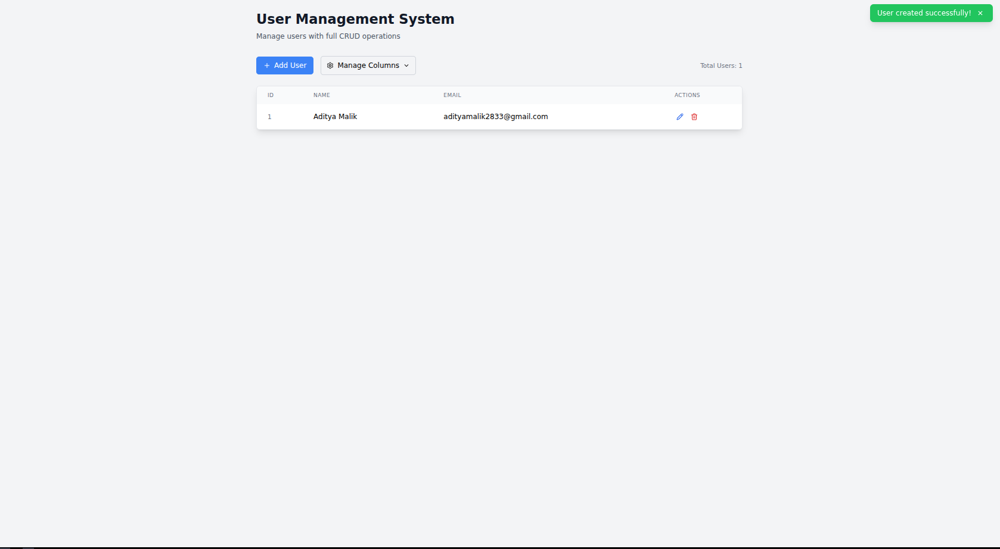

# User Management App 

A modern, responsive React application for managing users with full CRUD (Create, Read, Update, Delete) operations. Built with React hooks, Tailwind CSS, and featuring inline editing capabilities.


##  Features

-  Full CRUD Operations: Create, read, update, and delete users
-  Inline Editing: Edit user details directly in the table
-  Column Management: Show/hide table columns as needed
-  Responsive Design: Works seamlessly on desktop and mobile
-  Local Storage: Data persistence across browser sessions
-  Form Validation: Real-time validation with error messages
-  Notifications: Success/error feedback for user actions
-  Simulated Loading: Loading states for better UX

##  Demo

### Key Functionalities:
- Add new users with name and email validation
- Edit users inline or through a dedicated form
- Delete users with confirmation dialog
- Toggle column visibility
- Real-time validation and duplicate email detection
- Persistent data storage using localStorage

##  Technologies Used

- **React 18** - UI framework
- **React Hooks** - State management (useState, useEffect)
- **Tailwind CSS** - Styling and responsive design
- **Lucide React** - Beautiful icons
- **Vite** - Build tool and dev server
- **JavaScript ES6+** - Modern JavaScript features

##  Project Structure

```
src/
├── App.css                    # Global styles
├── App.jsx                   # Main application component
├── main.jsx                  # Application entry point
├── components/               # Reusable UI components
│   ├── ColumnManager.jsx    # Table column visibility manager
│   ├── EditableCell.jsx     # Inline editable table cell
│   ├── Notification.jsx     # Toast notification component
│   ├── UserForm.jsx         # User creation/editing form
│   └── UserList.jsx         # User table display
└── hooks/                   # Custom React hooks
    └── useLocalStorage.js   # localStorage hook for data persistence
```

##  Component Architecture

### Core Components

#### `App.jsx`
- **Purpose**: Main application container and state manager
- **Responsibilities**: 
  - Global state management for users and UI states
  - Orchestrates communication between components
  - Handles business logic for CRUD operations
  - Manages notifications and loading states

#### `UserForm.jsx`
- **Purpose**: Form component for creating and editing users
- **Features**:
  - Real-time form validation
  - Support for both create and edit modes
  - Error handling and display
  - Loading states during submission

#### `UserList.jsx`
- **Purpose**: Displays users in a responsive table format
- **Features**:
  - Dynamic column rendering based on visibility settings
  - Integration with EditableCell for inline editing
  - Action buttons for edit and delete operations
  - Empty state handling

#### `EditableCell.jsx`
- **Purpose**: Provides inline editing functionality for table cells
- **Features**:
  - Toggle between view and edit modes
  - Field-specific validation
  - Keyboard shortcuts (Enter to save, Escape to cancel)
  - Visual feedback for edit state

#### `ColumnManager.jsx`
- **Purpose**: Allows users to control table column visibility
- **Features**:
  - Dropdown interface for column selection
  - Persistent column preferences
  - Dynamic table rendering based on selections

#### `Notification.jsx`
- **Purpose**: Toast-style notifications for user feedback
- **Features**:
  - Auto-dismiss functionality
  - Success/error message types
  - Manual dismiss option

### Custom Hooks

#### `useLocalStorage.js`
- **Purpose**: Provides localStorage functionality with React state integration
- **Benefits**:
  - Automatic synchronization between state and localStorage
  - Error handling for localStorage operations
  - Consistent API similar to useState

##  Getting Started

### Prerequisites
- Node.js (version 14 or higher)
- npm or pnpm package manager

### Installation

1. **Clone the repository**
   ```bash
   git clone git@github.com:alarcritty/user-management.git
   cd user-management-app
   ```

2. **Install dependencies**
   ```bash
   npm install
   # or
   pnpm install
   ```

3. **Start the development server**
   ```bash
   npm run dev
   # or
   pnpm run  dev
   ```

4. **Open your browser**
   Navigate to `http://localhost:5173` to view the application

### Building for Production

```bash
npm run build
# or
pnpm build
```

The built files will be available in the `dist/` directory.

## 📱 Usage Guide

### Adding a New User
1. Click the "Add User" button
2. Fill in the required fields (Name and Email)
3. Click "Create" to save the user

### Editing a User
**Option 1: Inline Editing**
1. Hover over any name or email cell
2. Click the pencil icon that appears
3. Edit the value and press Enter or click the checkmark

**Option 2: Form Editing**
1. Click the pencil icon in the Actions column
2. Modify the fields in the form
3. Click "Update" to save changes

### Deleting a User
1. Click the trash icon in the Actions column
2. Confirm the deletion in the dialog

### Managing Columns
1. Click "Manage Columns" button
2. Check/uncheck columns to show/hide them
3. Your preferences are automatically saved


